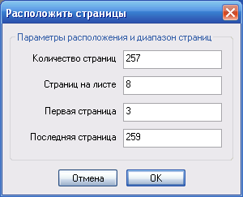
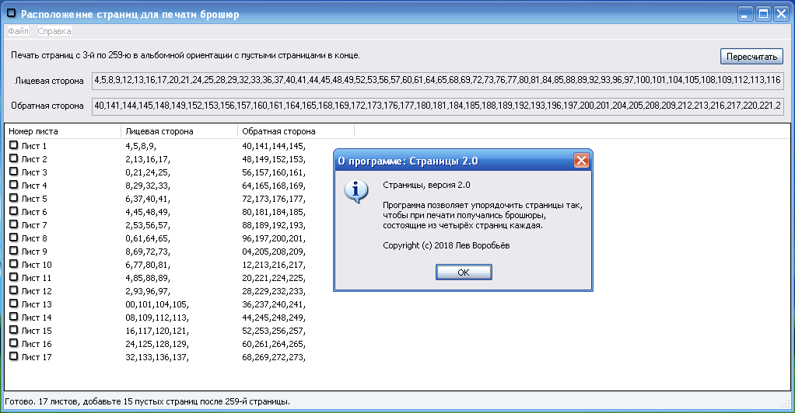

= Программа для печати брошюр

[glossary]
== Термины и определения

[[page]]Страница бумаги::
    Любая из двух сторон листа бумаги.

[[booklet]]Буклет, брошюра, листовка::
    Лист бумаги, сложенный вдвое.

== Назначение программы

Данная программа генерирует последовательность номеров страниц электронного документа так, чтобы при печати нескольких страниц на одной стороне листа получались брошюры.

== Инструкция по использованию

Запустив программу `pages5.exe` на экране появится диалоговое окно:

Параметры имеют следующий смысл:

Первая, последняя страница::
    Диапазон страниц электронного документа.

Страниц на листе::
    Сколько страниц исходного документа поместить на одной стороне листа.

Поле "количество страниц" заполняется автоматически.

Результат вычисляется после нажатия кнопки Далее:

== Лицензионное соглашение

Данная программа разработана "как есть", и автор не несёт никакой ответственности за возможные последствия некорректного использования программы.

